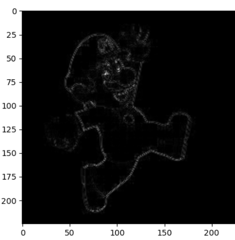
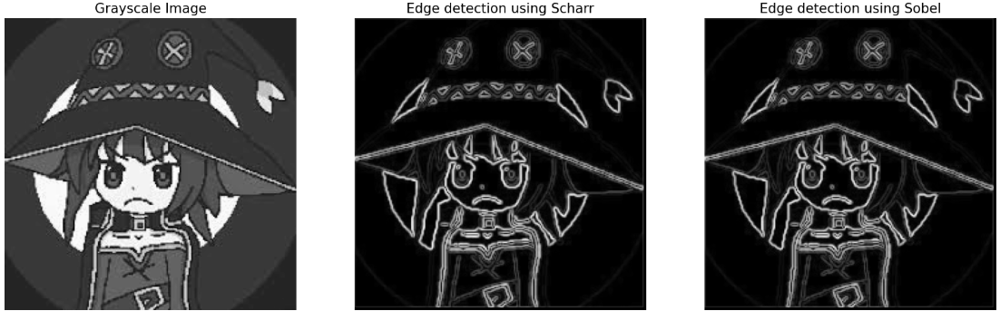
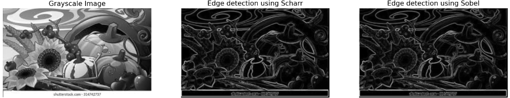
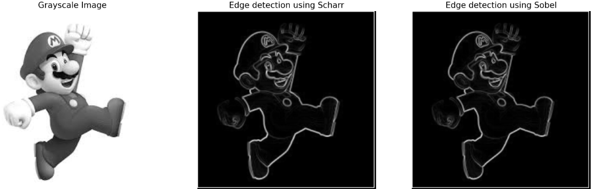
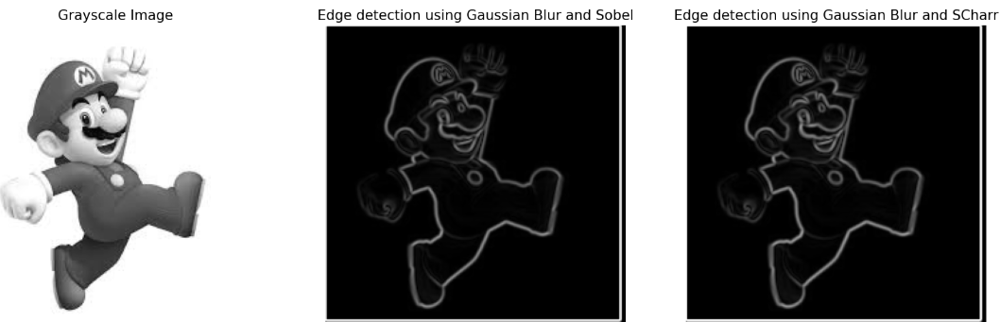

# Task 1: Edge Detection

## Choosing a filter

* A vast variety of filters are available on the internet some of which are 2X2 some 3X3 etc and all have their own advantages and disadvantages.

* I tried the laplacian filter but due to unsatisfactory results decided to not use it

* The most popular and obvious choices for a filter were **Sobel and Scharr**. Both of which are very efficient and give good results

## Padding

* I also decided to add one layer of zero padding to the image to keep the orginal dimensions intact

## Results till now

## Gaussian Blur

* i also tried using Gaussian blur before using the Sobel and Scharr but the results did not vary much and seemed to be an unnecessary computational cost

## Results

* The Sobel and Scharr gave the best results on their own with the Sobel being slighty better.